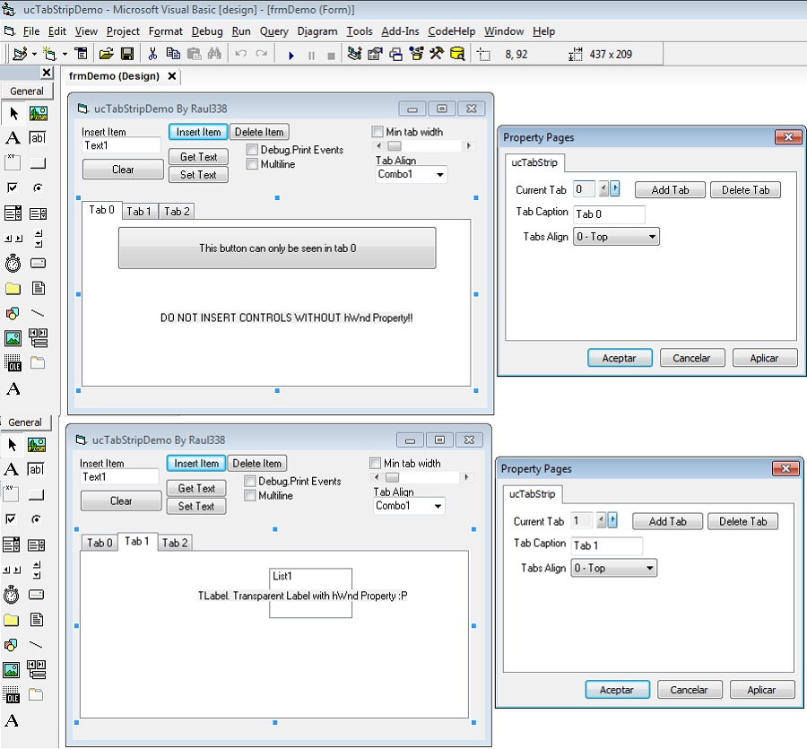



## ucTabStrip

### Description

2º UPDATE: Fixed crash when more than 30 controls added. Add control array sopourt

UPDATED: Fixed a Focus bug

UserControl to replace SSTabDialog OCX. Works like te SSTab, you can add controls wich can only be seen in the active tab. Includes a PropertyPage to edit Tabs and change the active Tab.

Please do not insert controls without the hWnd property or the control will fail
 
### More Info
 

             |
---                |---
**Submitted On**   |2011-12-10 10:28:08
**By**             |[raul338](https://github.com/Planet-Source-Code/PSCIndex/blob/master/ByAuthor/raul338.md)
**Level**          |Intermediate
**User Rating**    |3.0 (18 globes from 6 users)
**Compatibility**  |VB 6\.0
**Category**       |[Custom Controls/ Forms/  Menus](https://github.com/Planet-Source-Code/PSCIndex/blob/master/ByCategory/custom-controls-forms-menus__1-4.md)
**World**          |[Visual Basic](https://github.com/Planet-Source-Code/PSCIndex/blob/master/ByWorld/visual-basic.md)
**Archive File**   |[ucTabStrip22163112102011\.zip](https://github.com/Planet-Source-Code/raul338-uctabstrip__1-74007/archive/master.zip)

